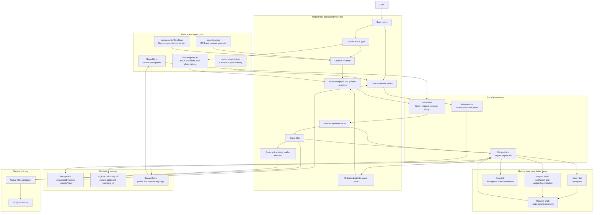
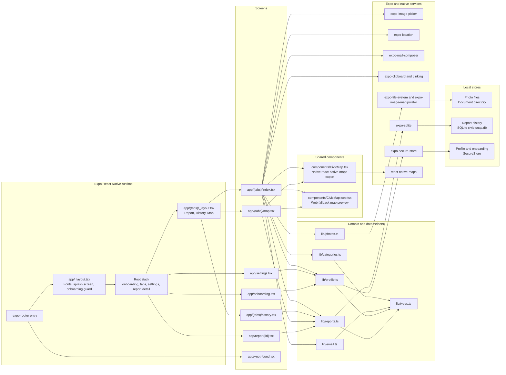

# Current App Diagrams

These diagrams describe the app as implemented now. The current MVP is local-first: report history, profile data, and photos stay on the device until the user chooses to hand an email draft to Mail.

## Data Flow

## App Architecture

## Current Boundaries

- No backend, auth, cloud sync, server storage, or OpenAI calls are wired into the app.
- The `supabase/` directory currently contains only local CLI temp metadata and is not referenced by app code.
- Sending is a handoff to the user's mail client. The app records `Mail opened`; it does not confirm receipt by 311.
