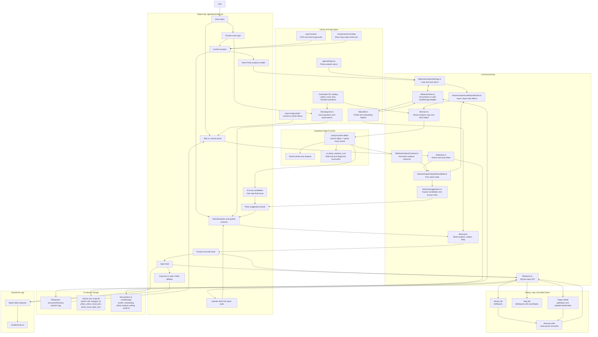
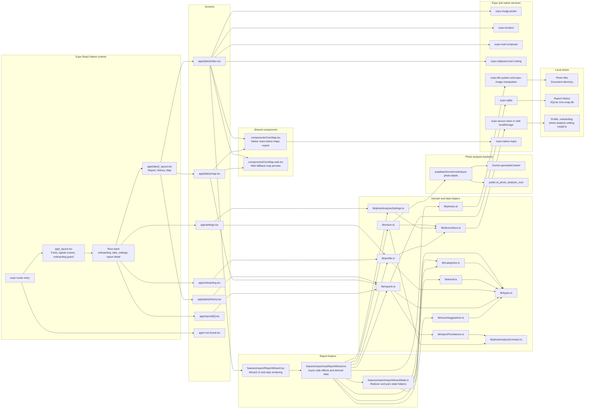

# Current App Diagrams

These diagrams describe the app as implemented now. The current MVP is local-first for saved reports, profile data, saved report photos, and Mail handoff. If photo analysis is configured and the user opts in, the app can also send a resized analysis copy of the current report photo to the Supabase Edge Function before Mail handoff.

## Data Flow

## App Architecture

## Current Boundaries

- Photo analysis is opt-in and sends a resized analysis copy of the report photo only to the Supabase Edge Function.
- Saved report photos, report history, profile data, and email drafts stay on device unless the user hands the draft to Mail.
- Address, GPS, location notes, user-written descriptions, profile fields, email text, and full reasoning are not sent to Gemini.
- Sending is a handoff to the user's mail client. The app records `Mail opened`; it does not confirm receipt by 311.
