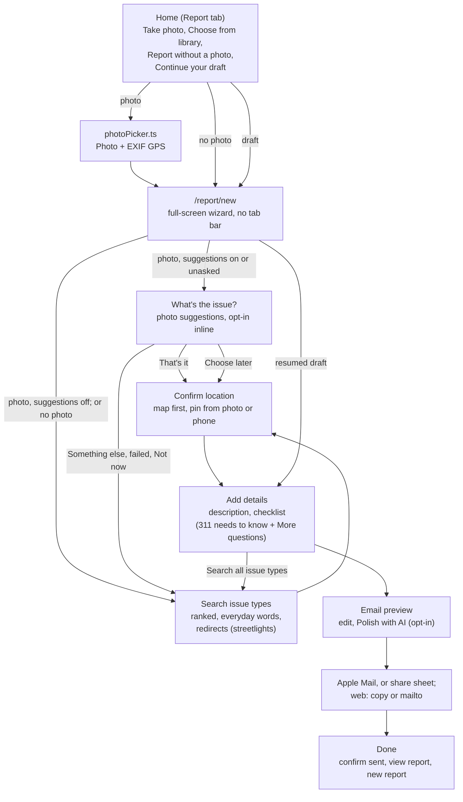
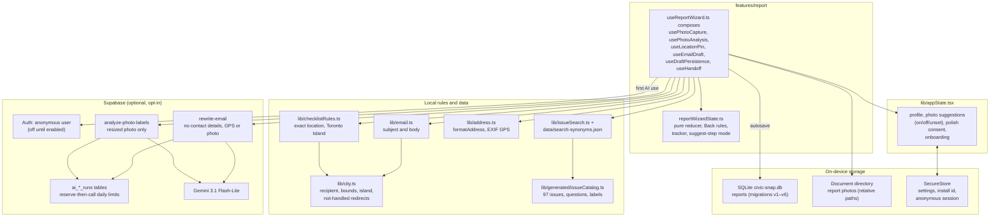
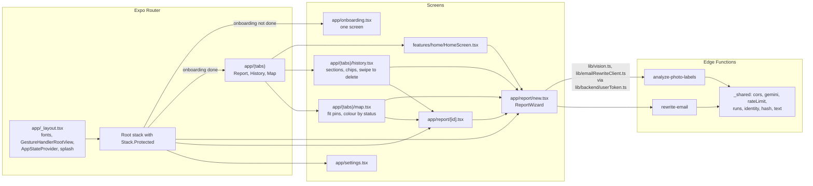

# Current App Diagrams

These diagrams describe the app as implemented after phases 4–6 of `docs/implementation-plan.md` (branches `phase-4/report-flow`, `phase-5/backend`, `phase-6/surfaces`). The app is local-first: reports, profile data, photos and the email handoff stay on the device. Two optional AI features call Supabase Edge Functions, each only after the user opts in.

## Report Flow

```mermaid
flowchart TD
  Home["Home (Report tab)\nTake photo, Choose from library,\nReport without a photo,\nContinue your draft"]
  Picker["photoPicker.ts\nPhoto + EXIF GPS"]
  Route["/report/new\nfull-screen wizard, no tab bar"]
  Suggest["What's the issue?\nphoto suggestions, opt-in inline"]
  Search["Search issue types\nranked, everyday words,\nredirects (streetlights)"]
  Location["Confirm location\nmap first, pin from photo or phone"]
  Details["Add details\ndescription, checklist\n(311 needs to know + More questions)"]
  Preview["Email preview\nedit, Polish with AI (opt-in)"]
  Handoff["Apple Mail, or share sheet;\nweb: copy or mailto"]
  Done["Done\nconfirm sent, view report, new report"]

  Home -->|photo| Picker --> Route
  Home -->|no photo| Route
  Home -->|draft| Route
  Route -->|photo, suggestions on or unasked| Suggest
  Route -->|photo, suggestions off; or no photo| Search
  Suggest -->|That's it| Location
  Suggest -->|Something else, failed, Not now| Search
  Suggest -->|Choose later| Location
  Search --> Location
  Location --> Details
  Details -->|Search all issue types| Search
  Details --> Preview --> Handoff --> Done
  Route -->|resumed draft| Details
```

## Data Flow

```mermaid
flowchart TD
  subgraph Wizard["features/report"]
    Reducer["reportWizardState.ts\npure reducer, Back rules,\ntracker, suggest-step mode"]
    Hooks["useReportWizard.ts composes\nusePhotoCapture, usePhotoAnalysis,\nuseLocationPin, useEmailDraft,\nuseDraftPersistence, useHandoff"]
  end

  subgraph Rules["Local rules and data"]
    City["lib/city.ts\nrecipient, bounds, island,\nnot-handled redirects"]
    Catalog["lib/generated/issueCatalog.ts\n97 issues, questions, labels"]
    Search["lib/issueSearch.ts +\ndata/search-synonyms.json"]
    Checklist["lib/checklistRules.ts\nexact location, Toronto Island"]
    Address["lib/address.ts\nformatAddress, EXIF GPS"]
    Email["lib/email.ts\nsubject and body"]
  end

  subgraph AppState["lib/appState.tsx"]
    Settings["profile, photo suggestions\n(on/off/unset), polish consent,\nonboarding"]
  end

  subgraph Device["On-device storage"]
    SQLite["SQLite civic-snap.db\nreports (migrations v1–v6)"]
    Files["Document directory\nreport photos (relative paths)"]
    Secure["SecureStore\nsettings, install id,\nanonymous session"]
  end

  subgraph Backend["Supabase (optional, opt-in)"]
    Auth["Auth: anonymous user\n(off until enabled)"]
    Analyze["analyze-photo-labels\nresized photo only"]
    Rewrite["rewrite-email\nno contact details, GPS or photo"]
    Runs["ai_*_runs tables\nreserve-then-call daily limits"]
    Gemini["Gemini 3.1 Flash-Lite"]
  end

  Hooks --> Reducer
  Hooks --> Settings
  Settings <--> Secure
  Hooks --> Search --> Catalog
  Hooks --> Checklist --> City
  Hooks --> Address
  Hooks --> Email --> City
  Hooks -->|autosave| SQLite
  Hooks --> Files
  Hooks -->|first AI use| Auth
  Hooks --> Analyze --> Gemini
  Hooks --> Rewrite --> Gemini
  Analyze --> Runs
  Rewrite --> Runs
```

## App Architecture

```mermaid
flowchart LR
  subgraph Runtime["Expo Router"]
    Root["app/_layout.tsx\nfonts, GestureHandlerRootView,\nAppStateProvider, splash"]
    Stack["Root stack with Stack.Protected"]
    Tabs["app/(tabs)\nReport, History, Map"]
  end

  subgraph Screens["Screens"]
    Onboarding["app/onboarding.tsx\none screen"]
    Home["features/home/HomeScreen.tsx"]
    History["app/(tabs)/history.tsx\nsections, chips, swipe to delete"]
    MapScreen["app/(tabs)/map.tsx\nfit pins, colour by status"]
    New["app/report/new.tsx\nReportWizard"]
    Detail["app/report/[id].tsx"]
    SettingsScreen["app/settings.tsx"]
  end

  subgraph Backend["Edge Functions"]
    Shared["_shared: cors, gemini, rateLimit,\nruns, identity, hash, text"]
    Fn1["analyze-photo-labels"]
    Fn2["rewrite-email"]
  end

  Root --> Stack
  Stack -->|onboarding not done| Onboarding
  Stack -->|onboarding done| Tabs
  Stack --> New
  Stack --> Detail
  Stack --> SettingsScreen
  Tabs --> Home
  Tabs --> History
  Tabs --> MapScreen
  Home --> New
  History --> New
  History --> Detail
  MapScreen --> New
  MapScreen --> Detail
  Detail --> New
  New -->|lib/vision.ts, lib/emailRewriteClient.ts\nvia lib/backend/userToken.ts| Fn1
  New --> Fn2
  Fn1 --> Shared
  Fn2 --> Shared
```

## Current Boundaries

- Photo suggestions are opt-in (asked inline on the first photo report, or in Settings) and send only a resized copy of the photo. The saved photo stays on the device.
- AI email polish is opt-in with a consent sheet. It sends the issue, description, address, location note and checklist answers; never contact details, GPS or the photo. The app adds those back on the device.
- When anonymous sign-ins are enabled in the project, the first AI request signs the install in as an anonymous user, which holds no data and only identifies the caller for the daily limits. Otherwise the app's install id is used, as before.
- Sending is a handoff to the user's email app (Apple Mail or the share sheet). The app records `handed_off` until the user confirms it was sent; it never confirms receipt by 311.
